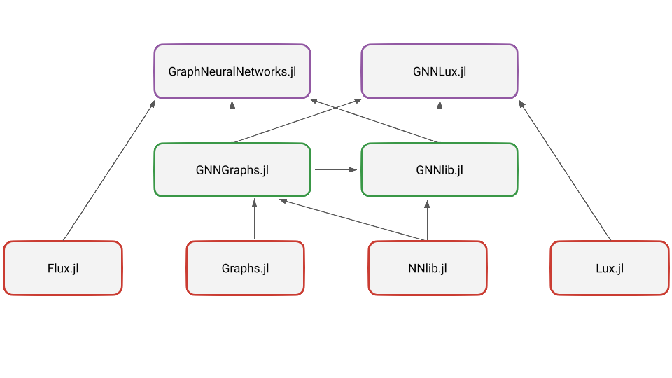

# GraphNeuralNetworks Monorepo

This is the monorepository for the GraphNeuralNetworks project, bringing together all code into a unified structure to facilitate code sharing and reusability across different project components. It contains the following packages:

- `GraphNeuralNetwork.jl`: Package that contains stateful graph convolutional layers based on the machine learning framework [Flux.jl](https://fluxml.ai/Flux.jl/stable/). This is fronted package for Flux users. It depends on GNNlib.jl, GNNGraphs.jl, and Flux.jl packages.

- `GNNLux.jl`: Package that contains stateless graph convolutional layers based on the machine learning framework [Lux.jl](https://lux.csail.mit.edu/stable/). This is fronted package for Lux users. It depends on GNNlib.jl, GNNGraphs.jl, and Lux.jl packages.

- `GNNlib.jl`: Package that contains the core graph neural network layers and utilities. It depends on GNNGraphs.jl and GNNlib.jl packages and serves for code base for GraphNeuralNetwork.jl and GNNLux.jl packages.

- `GNNGraphs.jl`: Package that contains the graph data structures and helper functions for working with graph data. It depends on Graphs.jl package.

Here is a schema of the dependencies between the packages:




Among its general features:

* Implements common graph convolutional layers both in stateful and stateless form.
* Supports computations on batched graphs. 
* Easy to define custom layers.
* CUDA support.
* Integration with [Graphs.jl](https://github.com/JuliaGraphs/Graphs.jl).
* [Examples](https://github.com/JuliaGraphs/GraphNeuralNetworks.jl/tree/master/GraphNeuralNetworks/examples) of node, edge, and graph level machine learning tasks. 
* Heterogeneous and temporal graphs. 

## Installation

GraphNeuralNetworks.jl, GNNlib.jl and GNNGraphs.jl are a registered Julia packages. You can easily install a package, for example GraphNeuralNetworks.jl, through the package manager :

```julia
pkg> add GraphNeuralNetworks
```

## Usage

Usage examples can be found in the [examples](https://github.com/JuliaGraphs/GraphNeuralNetworks.jl/tree/master/GraphNeuralNetworks/examples) and in the [notebooks](https://github.com/JuliaGraphs/GraphNeuralNetworks.jl/tree/master/GraphNeuralNetworks/notebooks) folder. Also, make sure to read the [documentation](https://juliagraphs.org/GraphNeuralNetworks.jl/graphneuralnetworks/) for a comprehensive introduction to the library and the [tutorials](https://juliagraphs.org/GraphNeuralNetworks.jl/tutorials/).


## Citing

If you use GraphNeuralNetworks.jl in a scientific publication, we would appreciate the following reference:

```
@misc{Lucibello2021GNN,
  author       = {Carlo Lucibello and other contributors},
  title        = {GraphNeuralNetworks.jl: a geometric deep learning library for the Julia programming language},
  year         = 2021,
  url          = {https://github.com/JuliaGraphs/GraphNeuralNetworks.jl}
}
```

## Acknowledgments

GraphNeuralNetworks.jl is largely inspired by [PyTorch Geometric](https://pytorch-geometric.readthedocs.io/en/latest/), [Deep Graph Library](https://docs.dgl.ai/),
and [GeometricFlux.jl](https://fluxml.ai/GeometricFlux.jl/stable/).


