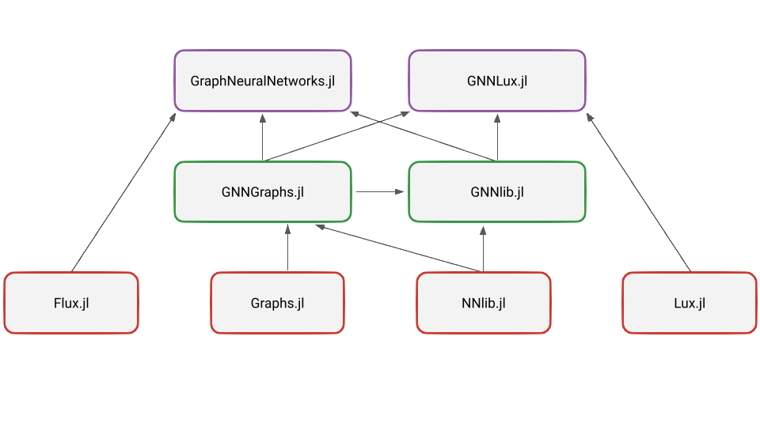

# GraphNeuralNetworks Monorepo

This repository is a monorepo that contains all the code for the GraphNeuralNetworks project. The project is organized as a monorepo to facilitate code sharing and reusability across different components of the project. The monorepo contains the following packages:

- `GraphNeuralNetwork.jl`: Package that contains stateful graph convolutional layers based on the machine learning framework [Flux.jl](https://fluxml.ai/Flux.jl/stable/). This is fronted package for Flux users. It depends on GNNlib.jl, GNNGraphs.jl, and Flux.jl packages.

- `GNNLux.jl`: Package that contains stateless graph convolutional layers based on the machine learning framework [Lux.jl](https://lux.csail.mit.edu/stable/). This is fronted package for Lux users. It depends on GNNlib.jl, GNNGraphs.jl, and Lux.jl packages.

- `GNNlib.jl`: Package that contains the core graph neural network layers and utilities. It depends on GNNGraphs.jl and GNNlib.jl packages and serves for code base for GraphNeuralNetwork.jl and GNNLux.jl packages.

- `GNNGraphs.jl`: Package that contains the graph data structures and helper functions for working with graph data. It depends on Graphs.jl package.

Here is a schema of the dependencies between the packages:

